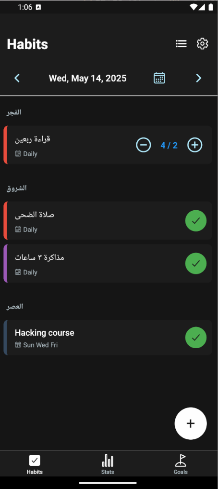
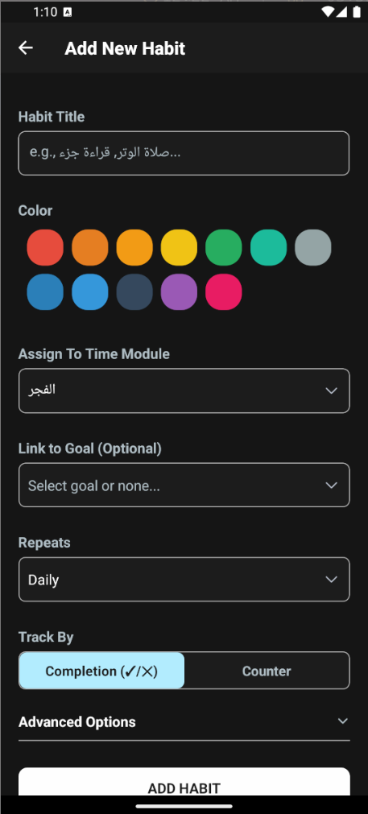
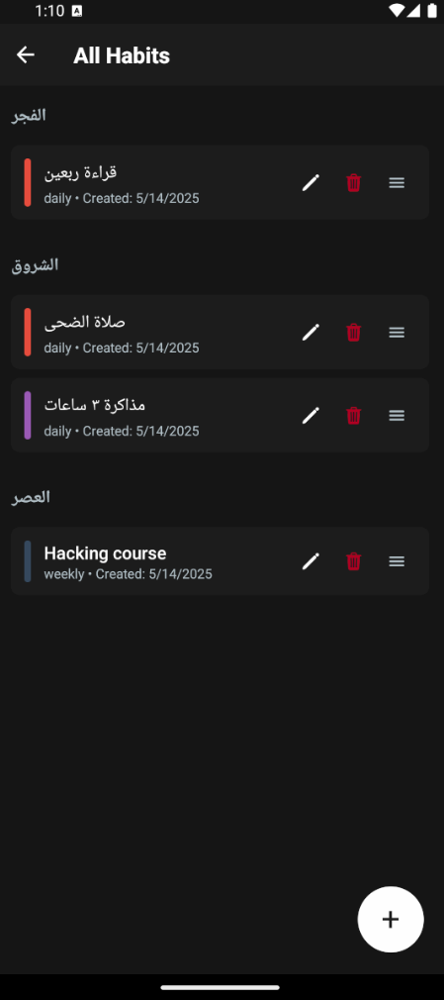
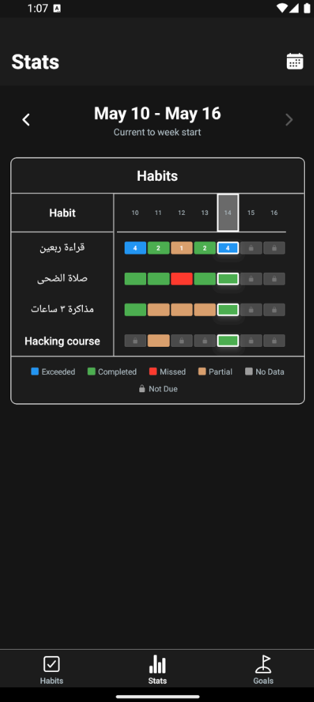
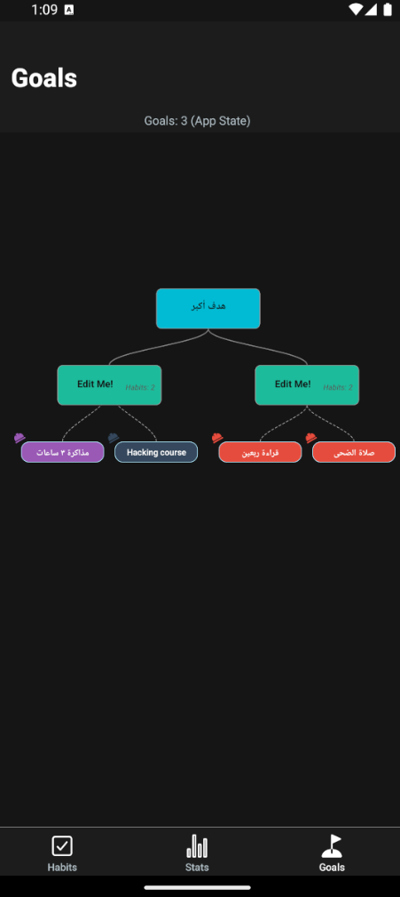
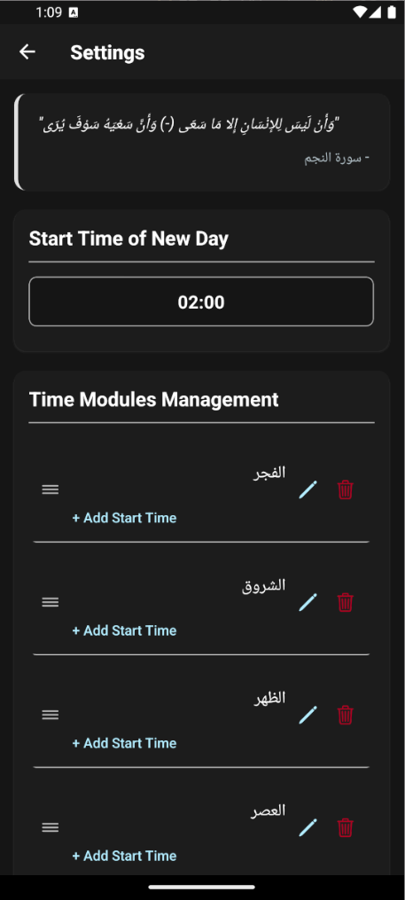

# Welcome to Dawem
داوم هو برنامج تتبع عادات/اوراد ويميزه العديد من المزايا المجانية بالكامل منها:
1. العادات اليومية والاسبوعية
2. واجهة سلسلة لتحليل انجازاتك
3. نظام فريد من نوعه في التعامل مع الأوراد المرنة كالعداد الاسبوعي
4. تقسيم اليوم الي وحدات أصلها الصلوات

# كيف يمكنك المساعدة؟
- اذا اكتشفت عطل واضح بلغ احد المطورين او اطلب سماح للتعديل
- يمكنك العمل على احد المزايا التي اتمنى اضافتها وطلب سماح للتعديل برضه

# للعمل عليه
- [x] اضافة نافذة اخرى للأهداف بحيث أن كل هدف يتكون من هدف اصغر والهدف الأصغر يتكون من اهداف اصغر او عادات بحيث ان العادة يمكن ان ترتبط بأكثر من هدف والعكس صحيح
- [ ] صفحة خاصة بكل عادة منفصلة على حدى تظهر فيها احصاءات خاصة بها
- [ ] خاصية تغيير يوم بداية الاسبوع
- [ ] خاصية تغيير اللغة
- [ ] خاصية تسمع بتغيير نظام تحديد اوقات العادات من الفترات الزمنية (الصلاة على النظام الافتراضي) الى الاوقات المحددة بالساعة
- [ ] جدول اسبوعي يوضح الوحدات اليومية وفي مقابلها الأيام ويظهر من خلالها الأعمال في جدول واضح في الفهم

### Building
```bash
git clone https://github.com/pxlman/dawem 
cd dawem/src
npm install
npx expo prebiuld
cd android
./gradlew assembleRelease # Now you can find the apk in dawem/src/android/app/build/outputs/apk/release/app-release.apk
```
# Screenshots
     
